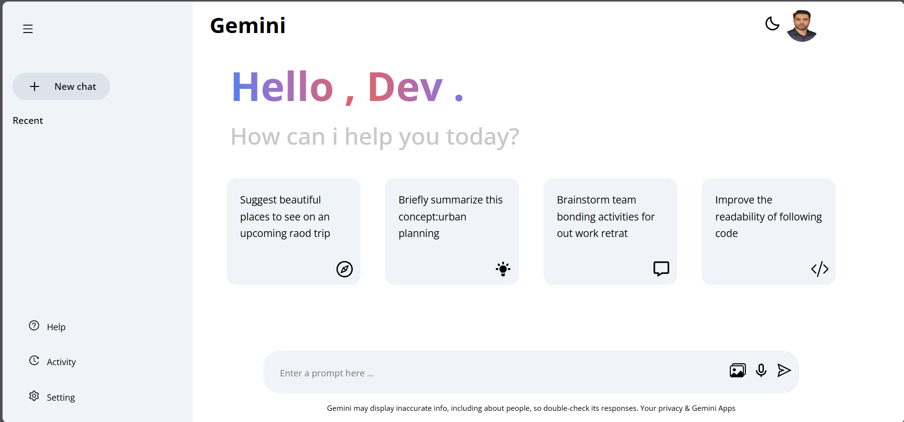
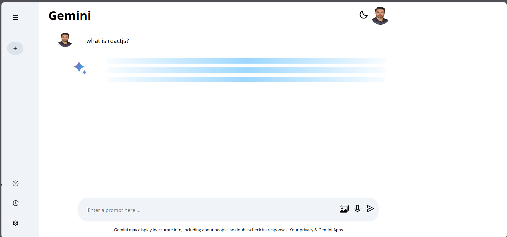
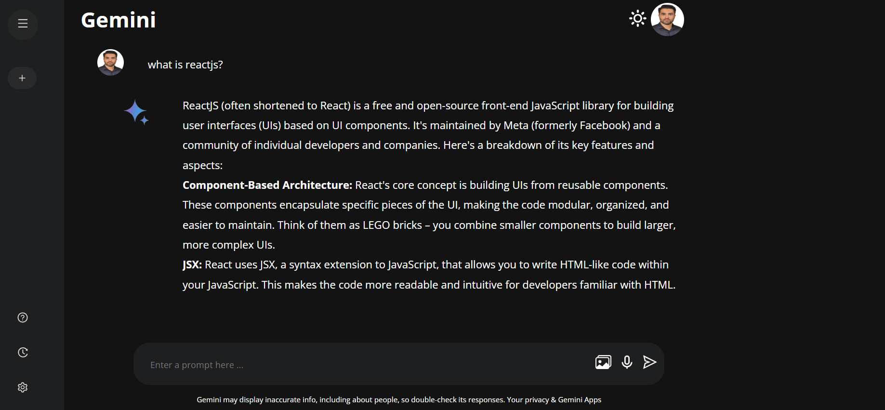

# 🚀 Gemini Clone

A clean and modern clone of **Gemini**, developed with love by [Mohammad Mehdi Rahimi](https://github.com/MohammadMehdiRahimi).  
This project showcases beautiful UI, responsive design, and real-world layout mimicking.


## 🔧 Features

- 💡 Gemini-like layout and UX
- 📱 Fully responsive design
- 🎨 Clean, reusable UI components
- ⚡ Built with modern front-end tools

---

## 🛠️ Tech Stack

- ⚛️ React
- ⚡ Vite / CRA (depending on setup)
- 💬 Custom components and layout


## 📦 Installation

Follow these steps to run the project locally:

```bash
# Clone the repository
git clone https://github.com/MohammadMehdiRahimi/gemini_clone.git

# Navigate into the project directory
cd gemini_clone

# Install dependencies
npm install

# Start the development server
npm run dev
```
## Folder Structure

gemini_clone/
```bash
├── public/
│   └── index.html
├── src/
│   ├── assets/
│   ├── components/
│   ├── pages/
│   ├── App.jsx
│   ├── index.js
│   └── main.jsx (if using Vite)
├── package.json
└── README.md
```

## 🤝 Contributing

Contributions are welcome!
If you have any idea, feedback, or improvement in mind, feel free to:

Fork the project

Create a new branch (git checkout -b feature/your-feature)

Commit your changes (git commit -m 'Add your message')

Push to the branch (git push origin feature/your-feature)

Open a Pull Request


## Images
<div styles="display=flex;gap=60px;">



</div>


## 🌟 A Note from the Developer


Built with 💚 by Mohammad Mehdi Rahimi
If you like this project, feel free to ⭐️ the repository and follow me on GitHub

## ✨ Final Words
"The best way to learn is to build."
This project is a testament to continuous growth, consistency, and the beauty of clean UI.


